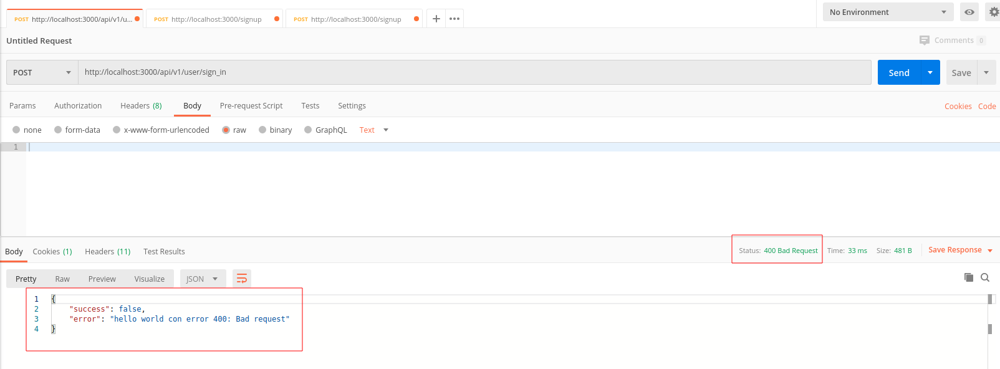
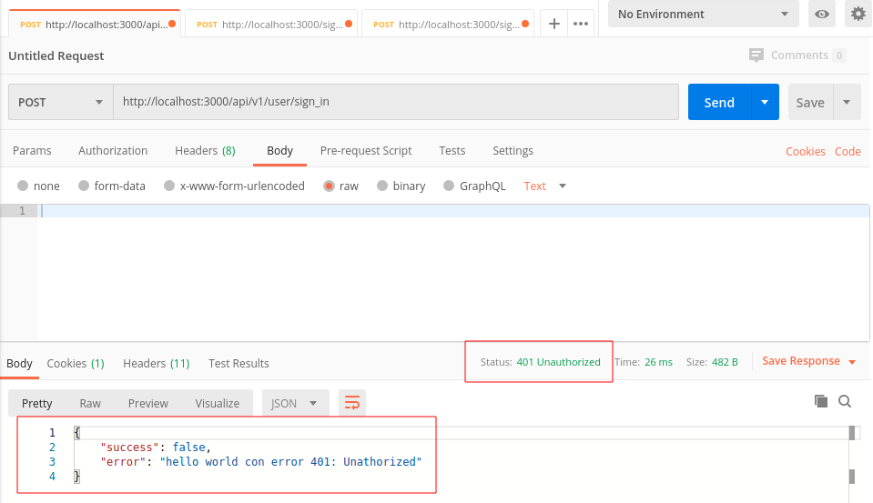

# README

Crear Proyecto 
~~~console
$ rails new railsnuxt1-api -d postgresql --api -T
~~~

Crear controladores 'sessions' para Login
~~~console
rails g controller Api::V1::User::Sessions sign_in sign_out me
~~~

## Explicación GK Error

Agregar la clase **GK Error** en **initializers** ('to_prepare' devuelve una respuesta que se ejecutará antes de cada solicitud en modo desarrollo o antes de la primera solicitud en producción)
~~~ruby
# config/initializers/gk_error.rb

Rails.configuration.to_prepare do
  class GKError < StandardError
  end

  class GKAuthenticationError < StandardError
  end
end
~~~

Configurar **AppController** para los errores 400 y 401 al realizar una solicitud a la API
~~~ruby
# app/controllers/api/app_controller.rb

class Api::AppController < ApplicationController
  rescue_from GKError, with: :handle_400
  rescue_from GKAuthenticationError, with: :handle_401

  def handle_400(exception)
    render json: { success: false, error: exception.message }, status: :bad_request and return
  end

  def handle_401(exception)
    render json: { success: false, error: exception.message }, status: :unauthorized and return
  end
end
~~~

En **SessionsController** generar una respuesta para error 400
~~~rb
# app/controllers/api/v1/user/sessions_controller.rb

class Api::V1::User::SessionsController < Api::V1::User::AppController
  def sign_in
    raise GKError.new("hello world con error 400: Bad request")
    #raise GKAuthenticationError.new("hello world con error 401")
  end

  def sign_out
  end

  def me
  end
end
~~~

Realizando prueba y obteniendo respuesta para error **400**

En **SessionsController** generar una respuesta para error 401
~~~rb
# app/controllers/api/v1/user/sessions_controller.rb

class Api::V1::User::SessionsController < Api::V1::User::AppController
  def sign_in
    #raise GKError.new("hello world con error 400: Bad request")
    raise GKAuthenticationError.new("hello world con error 401: Unathorized")
  end

  def sign_out
  end

  def me
  end
end
~~~

Realizando prueba y obteniendo respuesta para error **401**
